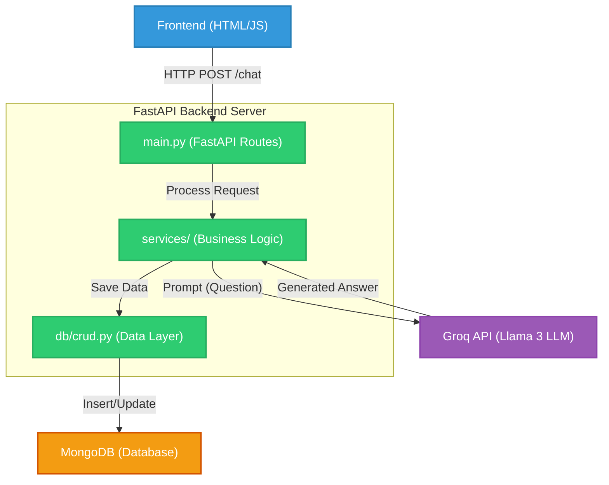
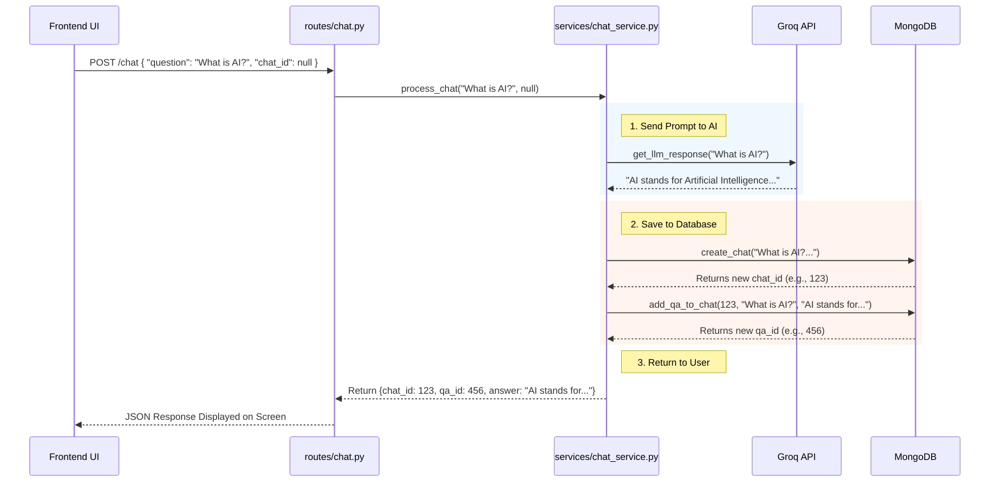
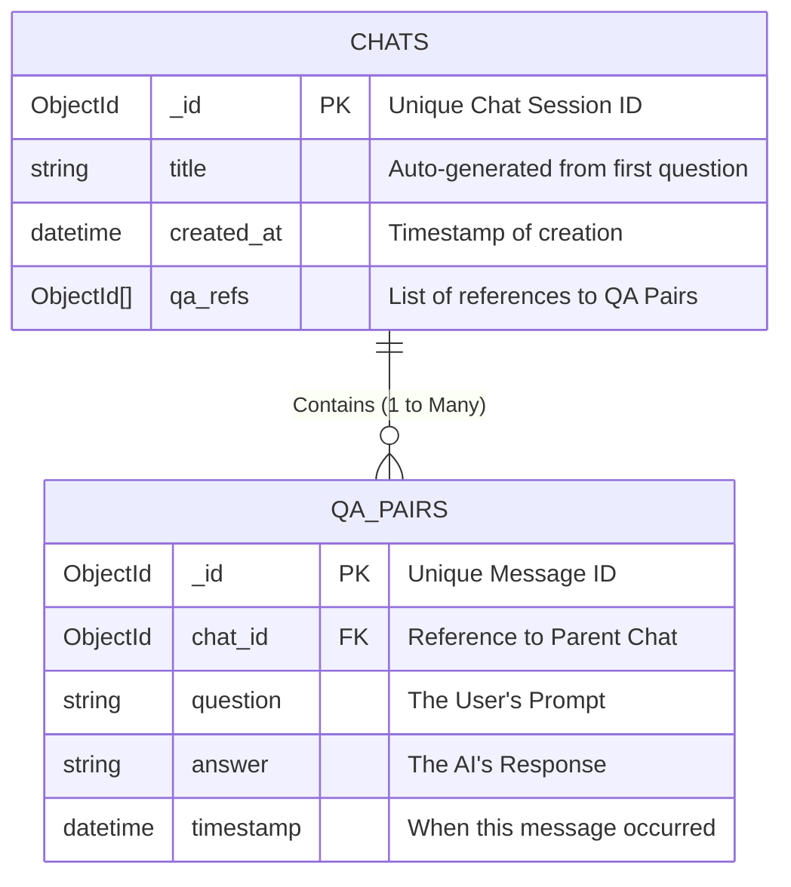
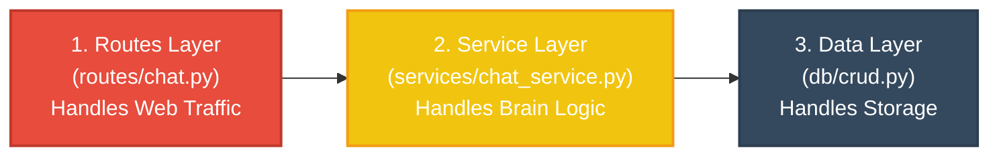

# 🏗️ Backend Architecture & Infrastructure

This document visualizes the entire infrastructure and data flow of the LLM Chatbot Backend. We use diagrams to explain how the pieces connect so anyone can understand it at a glance!

## 1. High-Level System Architecture

This diagram shows how all the major pieces of technology interact.

---

## 2. Request Data Flow (Step-by-Step)

What exactly happens under the hood when a user types a question and clicks "Send"?

---

## 3. Database Schema (Entity-Relationship)

We use two distinct collections in MongoDB to keep the data clean and relational, making it highly scalable.

---

## 4. Code Layering Architecture (Onion Model)

The code is strictly separated into modular layers. We do this so that the database code never accidentally mixes with the routing code.

### Why is it built this way?
1. **Modularity**: If you ever want to change Groq to OpenAI, you *only* touch `llm_service.py`. The rest of the app doesn't care!
2. **Database Swapping**: If you ever want to switch from MongoDB to PostgreSQL, you *only* touch `db/crud.py` and `db/database.py`. The routing and services don't change.
3. **Data Validation**: The Pydantic models sit as gatekeepers between the Frontend and the Routes layer, ensuring no bad data ever reaches the database.
