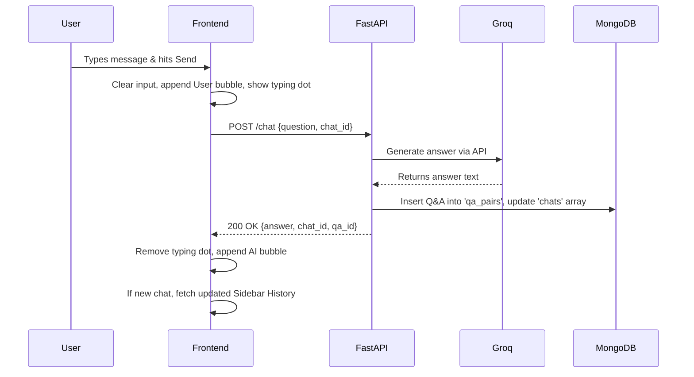
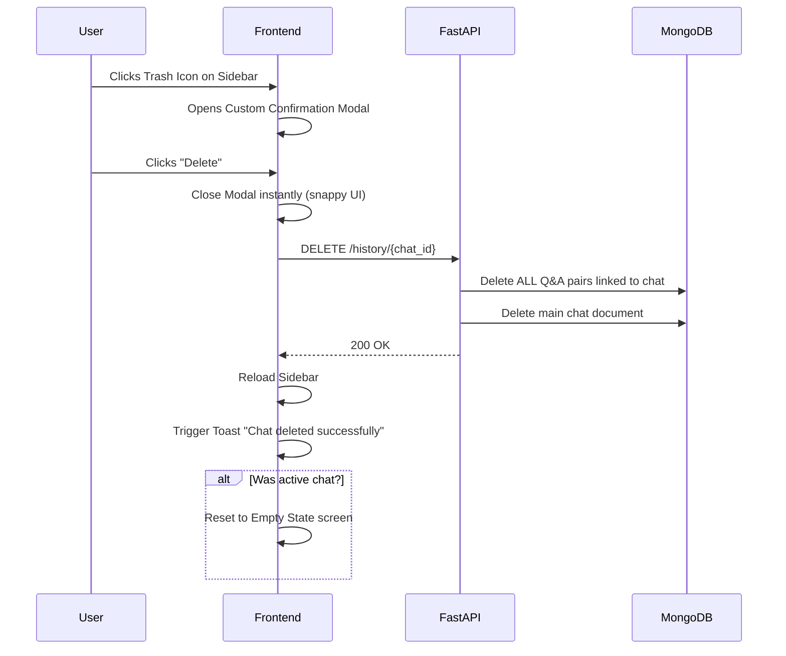

# 🤖 Minimal AI Chat - Frontend Architecture

This document details the frontend implementation, logic, and user workflows for the Minimal AI Chat application. It is designed to give developers, stakeholders, or future collaborators a comprehensive understanding of how the frontend interacts with the FastAPI backend, MongoDB, and the Groq LLM.

## 🛠 Tech Stack & Setup
- **Structure**: Vanilla HTML5 & JavaScript (No heavy frameworks like React/Vue, ensuring zero boilerplate).
- **Styling**: Tailwind CSS v4 (Compiled locally using Node modules for production-grade speed and tiny file sizes).
- **Icons**: Lucide Icons (via CDN).
- **Paradigm**: SPA (Single Page Application) behavior without page reloads.

---

## 🏗 High-Level Architecture Flow

The frontend acts as a lightweight, dumb client. All heavy computing, data persistence, and AI inferencing are securely handled by the Python backend.

```mermaid
graph TD
    subgraph Frontend "Frontend (Browser)"
        UI[UI / index.html]
        JS[app.js Logic]
    end

    subgraph Backend "FastAPI Backend (Port 8000)"
        Routes[API Routes]
        Services[Services layer]
    end
    
    subgraph External "External Resources"
        Mongo[(MongoDB)]
        Groq[Groq API / LLaMA 3.1]
    end

    UI <-->|DOM Events / DOM Updates| JS
    JS <-->|HTTP Requests (JSON)| Routes
    Routes <-->|Process Data| Services
    Services <-->|Read / Write| Mongo
    Services <-->|Prompt Inferencing| Groq
```

---

## 🧠 Core Logics Implemented

### 1. State Management
We handle application state manually in `app.js` using a single source of truth variable:
- `let currentChatId = null;`
- If this is `null`, sending a message triggers the creation of a **New Chat** on the backend. The backend returns a new unique `chat_id`, which we then save in this variable.
- If populated, all subsequent messages are appended to that existing `chat_id` in the database.

### 2. UI/UX Enhancements
To make this feel like a premium, modern application, several logic layers were added:
- **Typing Indicators:** A simulated "typing" bubble with 3 animated CSS dots appears immediately after the user sends a message. This prevents the app from feeling "frozen" while waiting for the Groq API network request to resolve.
- **Smooth Auto-scroll:** The `scrollToBottom()` function calculates the container's `scrollHeight` and uses `behavior: 'smooth'` to ensure the newest messages always slide elegantly into view.
- **Security:** The `escapeHTML()` function sanitizes all text before injecting it into the DOM to prevent XSS (Cross-Site Scripting) attacks from rogue inputs.

### 3. Custom Modal & Toast Notifications
We intentionally avoided using blocking native browser alerts (`window.confirm` / `alert`) because they freeze the UI thread and look unprofessional.
- **Modal:** A custom `div` managed via Tailwind transition utility classes (`opacity-0`, `scale-95`). State is tracked via `chatToDeleteId`.
- **Toast:** A dynamically created DOM element that slides in (`translate-x-0`), waits 3 seconds, and slides out before destroying itself from the DOM using `setTimeout`.

---

## 🔄 User Workflows

### Scenario A: Sending a Message (New or Existing Chat)



### Scenario B: Deleting a Chat Session



---

## 📂 File Structure Explained

- **/index.html**: The structural skeleton. Contains the sidebar, empty states, chat container, input form, and hidden modals.
- **/src/style.css**: The source styling. We import Tailwind here and add tiny raw CSS tweaks (like the custom sleek scrollbar design).
- **/src/output.css**: The massive, compiled, production-ready file generated by the Tailwind CLI. **(Do not edit manually)**
- **/src/app.js**: Contains 100% of the interactive logic, state management, DOM manipulation, and API fetching.
- **/package.json**: Holds our CLI tools and the build script used to re-compile the Tailwind CSS during development.
